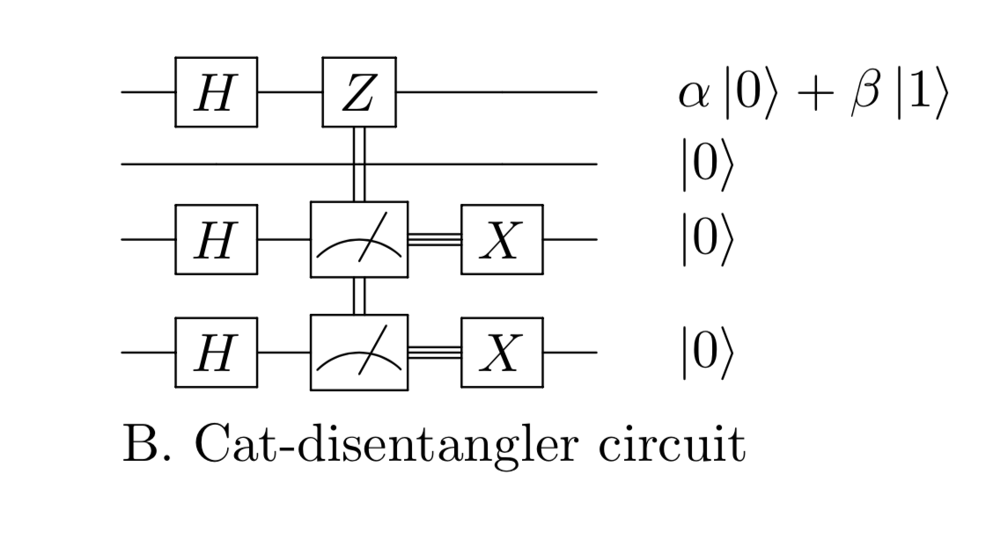
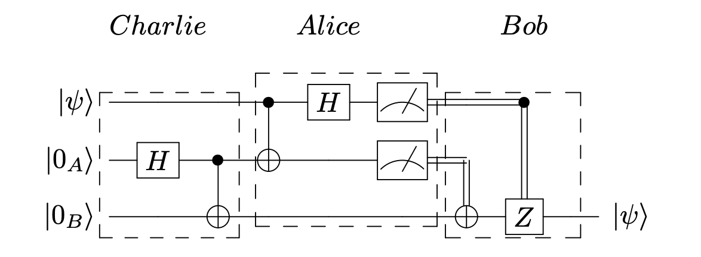

.. _distributed-protocol: 

=========================================================
Distributed Quantum Protocol
=========================================================

Due to a variety of constraints state-of-the-art quantum computers
are limited to working with a small system of qubits. As a result, current quantum computers are limited to solving small 
problems involving few qubits. 
Distributed quantum computing (DQC) is a means of leveraging the computational power of a quantum network 
in order to solve a problem too large for any single quantum computer. Each 
node on a quantum network is connected via a classical and quantum channel and managers its own
classical register for storing bits of information such as qubit measurements. Nodes may not
modify or interact with qubits that they do not manage without physically receiving the qubits
from a different node, performing teleportation, or via non-local operations.

In this demo we introduce netQuil's distributed protocol library that implements a set of
non-local operations commonly used in DQC. Specifically, this library will introduce the 
primitive cat-entangler and cat-disentangler as introduced by Yimsiriwattana and Lomonaco 
`(https://arxiv.org/abs/quant-ph/0402148)<https://arxiv.org/abs/quant-ph/0402148>`_, and their usage in non-local CNOTs, 
non-local controlled gates, and teleportation. 

Cat-Entangler
=============
The cat-entangler allows a single agent (Alice) in possession of a control qubit (:math:`|\psi\rangle = \alpha |0\rangle + \beta |1\rangle`)
to distribute control over multiple agents (Bob and Charlie), given that Alice, Bob, and Charlie
share a system of three entangled qubits (:math:`\frac{1}{\sqrt{2}}(|000\rangle + |111\rangle`) that can be placed in a cat-like state
(:math:`\alpha|0000\rangle + \beta|1110\rangle`). 

Protocol and Circuit
--------------------

.. image:: ../img/circuits/cat-entangler.png

The dark curved lines between wires two and four represent entangled qubits 
(i.e. :math:`\frac{1}{\sqrt{2}}(|000\rangle + |111\rangle)`). In this case, wires one and two
are owned by Alice, three by Bob, and four by Charlie. The double and triple lines represent a
measurement result, that is passed via a classical channel and used to control the X gates.  

Usage
-----
NetQuil's implementation of the cat-entangler requires that only one agent initiate and execute the circuit.
NetQuil will transport the qubits and cbits between agents, update their clocks, and appropriately apply noise.
If ``notify=True`` the cat-entangler will send a classical bit to each participating agent (excluding the caller), notifying
all parties that the entangler has finished. The caller is defined as the agent passed to the control. 
If ``entangled=False`` the cat_entangler will entangle the target qubits and the measurement qubit 
(i.e. :math:`a` is the measurement qubit in the example) before performing the circuit. 

.. code-block:: python
    :linenos:

    class Alice(Agent): 
        '''
        Alice initiates cat-entangler
        '''
        def run(self):
            # Define Qubits
            a, psi = self.qubits 
            b = bob.qubits[0]
            
            cat_entangler(
                control=(self, psi, a, ro),
                targets=[(bob, b)],
                entangled=False,
                notify=True
            )

    class Bob(Agent): 
        '''
        Bob waits to be notified that the cat-entangler has finished
        '''
        def run(self):
            # Measurement from cat-entangler
            self.crecv(alice.name)
            # Notification that cat-entangler is complete
            self.crecv(alice.name)
    
    # In this example we omit the following...
    # 1. Define Ro and Qubits
    # 2. Instantiate Agents
    # 3. Connect Agents
    # 4. Run Simulation

Cat-Disentangler
================
Once all agents have used the shared control bit to perform their local operation the
cat-disentangler can be used to restore the system to its former state.

Protocol
--------

The Z gate on the first wire is controlled by the exclusive-or (:math:`\oplus`) of the classical bits
resulting from the measurements on qubits two and three. If ``notify=True`` the cat-disentangler will send a classical bit 
to each participating agent (excluding the caller), notifying all parties that the entangler has finished. 
The caller is defined as the agent passed to the control. 

Usage
-----

.. code-block:: python
    :linenos:

    class Alice(Agent): 
        '''
        Alice initiates cat-disentangler 
        '''
        def run(self):
            a, psi = self.qubits 
            b = bob.qubits[0]

            cat_disentangler(
                control=(self, psi, ro),
                targets=[(bob, b)],
                notify=True
            )

    class Bob(Agent):
        '''
        Bob waits for cat-disentangler to finish
        '''
        def run(self): 
            # Wait for cat-disentangler to finish
            self.crecv(alice.name)
            # ... Perform operations with teleported state
            b = bob.qubits[0]

Non-local CNOT and Teleportation
================================
The cat-entangler and cat-disentangler are primitive circuits that can be used 
to contruct non-local CNOT gates, non-local controlled gates and teleportation. 
In fact, it has been proven that the controlled-NOT gate, Hadamard gate, and \ang{45} phase gate together
can be composed to create a universal quantum gate. Therefore, 
in order to contruct a universal set of operators for DQC, we must only contruct a 
non-local CNOT gate, which can be done with the cat-entangler and cat-disentangler. 

Protocol
--------

.. image:: ../img/circuits/non-local-cnot.png

The swap gate in the teleportation circuit is only necessary in order to fully restore 
the third qubit to its original state. 

Example
-------
Here is an example of teleportation using the cat-entangler and cat-disentangler. 

.. code-block:: python
    :linenos: 

    import sys
    sys.path.insert(0, '/Users/zacespinosa/Foundry/netQuil')
    sys.path.insert(1, '/Users/matthewradzihovsky/documents/netQuil')

    from pyquil import Program
    from pyquil.api import WavefunctionSimulator, QVMConnection
    from pyquil.gates import *
    from netQuil import *

    class Alice(Agent): 
        ''' 
        Alice uses cat-entangler and cat-disentangler to teleport psi to Bob
        '''
        def teleportation(self, psi, a, b):
            cat_entangler(
                control=(self, psi, a, ro),
                targets=[(bob, b)],
                entangled=False,
                notify=False
            )
            cat_disentangler(
                control=(bob, b, ro),
                targets=[(self, psi)],
            )

        def run(self):
            # Define Qubits
            a, psi = self.qubits 
            b = bob.qubits[0]

            # Teleport
            self.teleportation(psi, a, b)

    class Bob(Agent): 
        ''' 
        Bob waits for teleportation to complete
        '''
        def run(self):
            # Receive Measurement from Cat-entangler
            self.crecv(alice.name)

    p = Program()

    # Prepare psi
    p += H(2)
    p += RZ(math.pi/2, 2)

    # Create Classical Memory
    ro = p.declare('ro', 'BIT', 3)

    alice = Alice(p, qubits=[0,2], name='alice')
    bob = Bob(p, qubits=[1], name='bob')

    QConnect(alice, bob)
    CConnect(alice, bob)

    Simulation(alice, bob).run()
    qvm = QVMConnection()
    qvm.run(p)

Source Code
-----------
The source code for the cat-entangler can be found on `Github <https://github.com/att-innovate/netQuil>`_ and contributions are encouraged. 
To learn more about distributed quantum computing and the cat-like state checkout
`this <https://arxiv.org/abs/quant-ph/0402148>`_ paper by Yimsiriwattana and Lomonaco. 
To see why quantum security is so powerful, checkout our tutorial on the middle-man attack!

