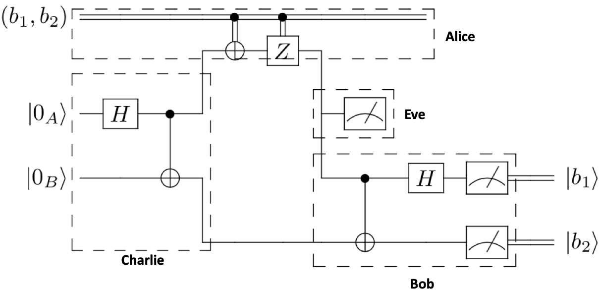
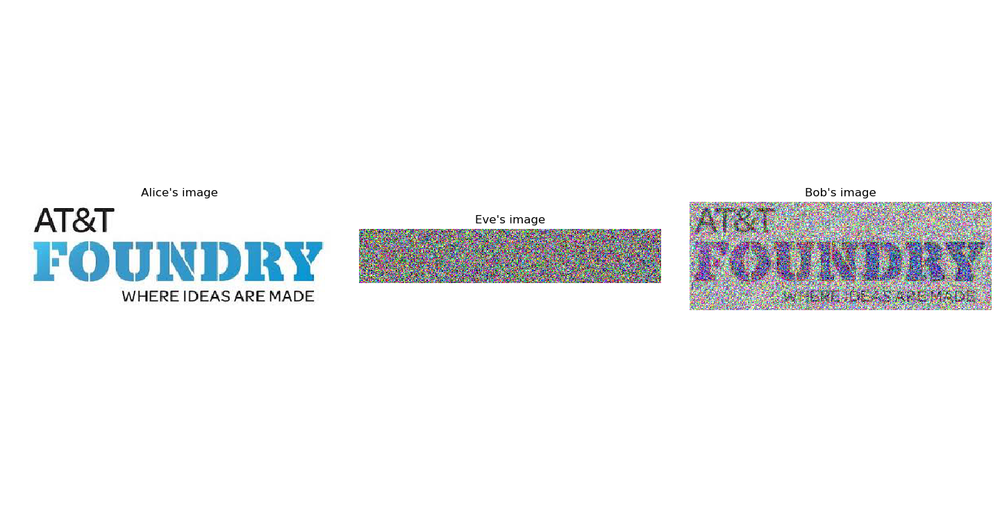

.. _middle-man: 

=========================================================
Middle-Man Attack
=========================================================

Middle-Man Attack is a demonstration of quantum networks resistance against intruders. This demo 
extends :ref:`superdense coding <superdense-coding>` by allowing two agents, Alice and Bob, to send 
numerous classical bits using bell state pairs. However, in this protocol, there is an intruder agent,
Eve, who attempts to interecept and measure the information. Despite successfully intercepting Alice 
and Bob's message, due to Eve not sharing a bell state pair with Alice, Eve only measures random noise.
Moreover, Bob's is able to detect an intruder has intercepted the message.

Protocol
=========================================================
The middle-man attack involves four agents, Alice, Bob, Charlie, and Eve.
Following the :ref:`superdense coding <superdense-coding>` protocol,
Charlie prepares the bell state pair and distributes the entangled qubits to Alice and Bob,
where Alice operates on her bell state pair from Charlie based on the classical bits
she wishes to send to Bob, and then sends her bell state pair to Bob. This process can be repeated
for any number of classical bits that Alice wishes to send. 

The attack occurs when Eve intercepts Alice's qubits on the way to Bob, measures the qubits, 
and re-transmits them to Bob. Due to Eve not having a bell state pair and her measurement collapsing
the state of the qubit, Eve only intercepts random noise, while Bob can immediately detect the 
presence of an intruder. 

Circuit
----------------------------------------

Steps 
----------------------------------------
1. Charlie creates a bell state pair using a Hadamard (:math:`\textbf{H}`) and Controlled-Not (:math:`\textbf{CNOT}`) gate,
:math:`|AB\rangle = \frac{1}{\sqrt{2}}(|00\rangle + |11\rangle) `, sending qubit :math:`A` to Alice and qubit :math:`B` to Bob. 

2. Alice operates on her qubit based on the classical bits she wants to send to Bob. If her first classical 
bit is a :math:`1`, she operates on her qubit with a :math:`\textbf{X}` gate. If her second classical bit is a
:math:`1`, she operates on her qubit with a :math:`\textbf{Z}` gate. Then, she sends her qubit (unknowingly) to intruder Eve.

3. Eve measures the qubit from Alice and re-transmits it to Bob.

4. Bob returns to the computational basis by applying a Controlled-Not (:math:`\textbf{CNOT}`) and 
a Hadamard (:math:`\textbf{H}`) gate to the qubit from Charlie and from Eve (thinking it is from Alice.
Finally, Bob measures each qubit and now has both of Alice's classical bits.

Tutorial
=========================================================
We will now implement middle-man attack using netQuil's framework of ref:`Agent <agent>` and ref:`Connections <connections>` 
to simulate teleportation of a quantum state using a quantum network. The ref:`Devices <devices>` module 
and ref'Noise <noise>' allows you to include realistic devices with noise in your quantum network.

Import Dependencies 
----------------------------------------
.. code:: python

    from netQuil import *
    from pyquil import Program
    from pyquil.api import QVMConnection
    from pyquil.gates import *

Setup Agents 
----------------------------------------
Let us first define agent Charlie who creates and distributes the bell state pair to Alice and Bob repeated for the 
number of classical bits that Alice wishes to send. We can extend the Agent classes and redefine our 
:math:`\textit{run()}` methods. To create our bell state pair, he can use a
Hadamard (:math:`\textbf{H}`) and Controlled-Not (:math:`\textbf{CNOT}`) gate from pyquil. Then,
using netQuil, we want to distribute each qubit to Alice and Bob.

.. code:: python

    class Charlie(Agent):
    '''
    Charlie sends Bell pairs to Alice and Bob
    '''
    def run(self):
        p = self.program
        for i in range(0,len(alice.cmem),2):
            p += H(i)
            p += CNOT(i, i+1)
            self.qsend(alice.name, [i])
            self.qsend(bob.name, [i+1])

Now, we will create agent Alice, Eve, and Bob. Alice will operate on her bell state pair from Charlie based on the
classical bits she wishes to send to Bob. Then, she will send her qubit to Bob, but unknowingly the qubit
is intercepted by Eve. Eve is an intruder, and simply measures the intercepted information, before retransmitting
the qubit on to the target agent, Bob. Bob will then convert back to the computational basis using a 
Controlled-Not (:math:`\textbf{CNOT}`) and a Hadamard (:math:`\textbf{H}`) gate and measure each qubit
from Charlie and Alice, with Alice's qubit tampered with by Eve.

.. code:: python

    class Alice(Agent):
        '''
        Alice sends Bob superdense-encoded classical bits, intercepted by Eve
        '''
        def run(self):
            p = self.program
            for i in range(0,len(self.cmem),2):
                bit1 = self.cmem[i]
                bit2 = self.cmem[i+1]
                qubitsCharlie = self.qrecv(charlie.name)
                a = qubitsCharlie[0]

                if bit2 == 1: p += X(a)
                if bit1 == 1: p += Z(a)
                
                self.qsend(eve.name, [a])

    class Bob(Agent):
        '''
        Bob reconstructs Alice's classical bits
        '''
        def run(self):
            p = self.program
            for i in range(0,len(alice.cmem),2):
                qubitsAlice = self.qrecv(eve.name)
                qubitsCharlie = self.qrecv(charlie.name)
                a = qubitsAlice[0]
                c = qubitsCharlie[0]
                p += CNOT(a,c)
                p += H(a)
                p += MEASURE(a, ro[i])
                p += MEASURE(c, ro[i+1])

    class Eve(Agent):
        '''
        Eve intercepts message from Alice, measures, and sends to Bob
        '''
        def run(self):
            p = self.program
            for i in range(0,len(alice.cmem),2):
                qubitsAlice = self.qrecv(alice.name)
                a = qubitsAlice[0]
                p += MEASURE(a, ro[i+len(alice.cmem)])
                self.qsend(bob.name, [a])

Set Up Program
----------------------------------------
We can now define our pyquil program to pass into each agent. First, let us define the classical bits that
we want Alice to attempt to send to Bob. For this example, we will unpack our netQuil logo as classical bits
that Alice will send to Bob, and thus will import matplotlib.image. We also define our readout bits for Eve's
and Bob's measurements, which are stored together in 'ro'.

.. code:: python

    import matplotlib.image as image

    img = image.imread("./Images/Logo.jpeg")
    img_bits = list(np.unpackbits(img))

    program = Program()
    ro = program.declare('ro', 'BIT', 2*len(img_bits))

Now, we can create our agents, giving Charlie control over all the qubits, Alice the image as
her classical memory, and passing each agent their shared pyQuil program to run our demo. For 
convenience, we will also give Eve and Bob individual lists to store their individual results.

.. code:: python
    
    qubitsUsed = list(range(len(img_bits)))
    resultsEve = []
    resultsBob = []

    alice = Alice(program, cmem=img_bits)
    bob = Bob(program)
    charlie = Charlie(program, qubits=qubitsUsed)
    eve = Eve(program)

    QConnect(alice, bob, charlie, eve)

Simulate Network
----------------------------------------
Finally, we can define our agents, connect them, and simulate our program. 

.. code:: python

    #define agents
    alice = Alice(program, cmem=curImg_bits)
    bob = Bob(program)
    charlie = Charlie(program, qubits=qubitsUsed)
    eve = Eve(program)

    #connect agents
    QConnect(alice, bob, charlie, eve)

    #simulate agents
    Simulation(alice,charlie,bob,eve).run()
    qvm = QVMConnection()
    results = qvm.run(program)

Oh no, simulating our network created an error. We need to be careful because netQuil does quantum computation on pyQuil,
which limits the number of qubits to 30. Therefore, instead of Alice sending all her image bits at once, 
we can fix this bug by only having Alice send qubits in groups of 20 as follows:

.. code:: python

    #window of current quantum bits
    startWindow = 0
    endWindow = 20
    
    while end <= len(img_bits):
        curImg_bits = img_bits[start:end]
        qubitsUsed = list(range(len(curImg_bits)))

        program = Program()
        ro = program.declare('ro', 'BIT', 2*len(curImg_bits))

        #define agents
        alice = Alice(program, cmem=curImg_bits)
        bob = Bob(program)
        charlie = Charlie(program, qubits=qubitsUsed)
        eve = Eve(program)

        #connect agents
        QConnect(alice, bob, charlie, eve)

        #simulate agents
        Simulation(alice,charlie,bob,eve).run()
        qvm = QVMConnection()
        results = qvm.run(program)

        #record results
        resultsBob.extend(results[0][0:len(curImg_bits)])
        resultsEve.extend(results[0][len(curImg_bits):])

        #iterate
        start = end
        if end == len(img_bits):
            break
        elif len(img_bits) >= end+20:
            end += 20
        else:
            end = len(img_bits)

Check Results
----------------------------------------
We can check if on Eve's and Bob's measurements by plotting the images. Notice, that since Eve
does not share a bell state pair with Alice, she only measures random noise. Further, her measurements
collapse the qubits before Bob measures them giving him only half of the information and alerting him
to an intruder.

Extend Simulation
----------------------------------------
You have now created a program to simulate a middle man attack! You are able to simulate an intruder
trying to intercept qubits of information. Can you extend this demo to include quantum error correction, 
a smarter intruder, or even devices with realistic noise?

Source Code
=========================================================
The source code for the middle-man attack demo can be found `here <https://github.com/att-innovate/netQuil>`_ and contributions are encouraged. 

To learn more about distributed quantum computing, checkout our distributed protocols tutorial to learn how you can 
perform distributed quantum computation easily using the cat-entangler and cat-disentangler. 
